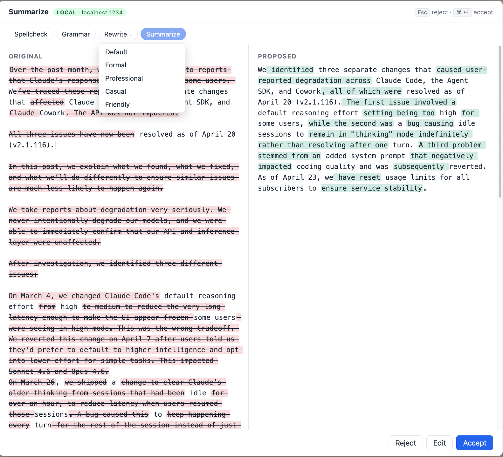
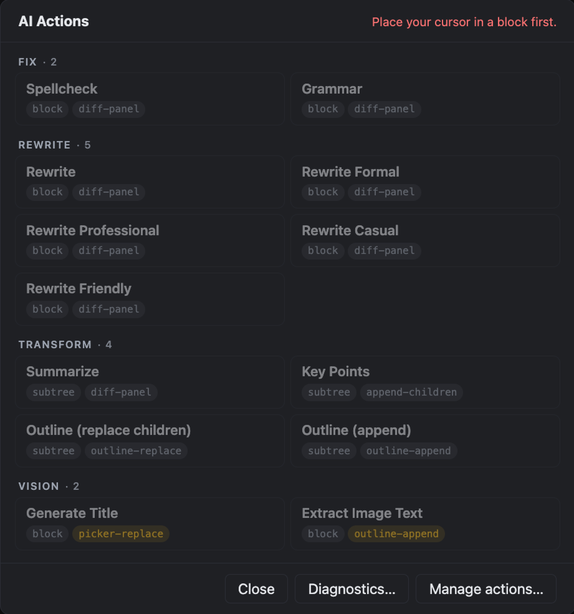

# AI Actions for Logseq

AI-driven actions on Logseq blocks — spellcheck, grammar, rewrite (with tone variants), summarize, key-point extraction, nested outlines, image titling, image OCR — powered by a **small, locally-hosted LLM** you control (LM Studio, Ollama, or any OpenAI-compatible endpoint). Vision actions work with multimodal models like `qwen3.5:2b`, `qwen2.5-vl`, or `llava`.



> **DB graphs only** in v1. File-graph support is on the v2 backlog.
> **Privacy-first**: by default, block content is sent to an endpoint on your own machine (`localhost`). The plugin labels endpoints LOCAL or REMOTE in the settings so you know exactly where your notes are going.

---

## Why

Knowledge-graph notes deserve thoughtful AI assistance — but not at the cost of shipping your private thinking to a third-party cloud. This plugin runs entirely against an LLM server you start yourself. No accounts, no tokens, no egress beyond your machine unless you *explicitly* point it at a remote endpoint.

## Features (v1)

- **Text seed actions** (run on a block or its subtree):
  - `spellcheck` — fix typos. Surgical: preserves proper nouns, code, URLs, wikilinks, tags.
  - `grammar` — fix objective grammatical errors. Logseq-aware: respects bullet-style fragments, contractions, lowercase starts.
  - `rewrite` — rephrase for clarity and concision; review via diff before accepting.
  - `rewrite-formal` / `rewrite-professional` / `rewrite-casual` / `rewrite-friendly` — tone variants. `rewrite-professional` follows "Writing the Amazon Way" (declarative sentences, active voice, no weasel words).
  - `summarize` — TL;DR of a block and its descendants; written into the parent, children preserved.
  - `key-points` — extract bullet-list points; appended as new children under the block.
  - `outline-replace` / `outline-append` — generate a nested outline of a subtree. Replace destroys existing children; Append preserves them. Markdown tables in the LLM output are kept as standalone blocks.
  - `improve` — **Improve (restructure)**: revise a subtree, page or selection into a clearer, better organised outline that keeps every fact (Outline condenses; Improve doesn't). You review it as a diff of the original outline against the revised one (edit or copy it there); accepting adds it as new blocks. The originals keep their properties, task status and dates; the new outline is text only (inline `#tags` and `[[links]]` are kept).
- **Pages and selections**: run any text action on several selected blocks or on a whole page or journal from the command palette or a keyboard shortcut. See [Run on a page or several blocks](#run-on-a-page-or-several-blocks).
- **Vision seed actions** (run on image asset blocks — blocks tagged `:logseq.class/Asset`):
  - `image-title` — analyze the image and propose three candidate titles in a picker; chosen value writes to `:block/title`.
  - `extract-image-text` — OCR the image and append the extracted text as nested children. Well-formed tables in the source render as standalone markdown-table blocks.
- **Entry points**: slash commands (`/AI <action>`), block context menu, command palette, assignable keyboard shortcuts, toolbar button (action picker).

  

- **Extensibility**: add your own actions through the **Manage Actions** UI (gallery of cards + inline editor with live validation) or the hand-editable `userActionsJson` setting. Hot-reloads into the registry on save.
- **Trust signals**: every UI surface that shows the configured endpoint labels it `LOCAL` or `REMOTE`. Before the first request to a non-loopback host (and again whenever that host changes) you are asked to confirm; the prompt also warns if an API key would go over plain `http://`.
- **Debug log (opt-in)**: in-memory ring buffer of the last 50 requests (request shape, response preview, duration, error if any), viewable in `/AI Diagnostics`. Never written to disk.

> Planned for v2: per-invocation scope/output override, form-based settings panel, WebLLM provider, true selection-scope with block-range splicing. See [`tasks.md`](./tasks.md) and [`REQUIREMENTS.md`](./REQUIREMENTS.md).

## Quick start

### 1. Start a local OpenAI-compatible LLM server

| Preset | Default URL | How to start |
|---|---|---|
| **LM Studio** *(primary default)* | `http://localhost:1234/v1` | LM Studio → **Developer** → **Start Server** |
| **Ollama** | `http://localhost:11434/v1` | `ollama serve` (and `ollama pull <model>` for a first model) |
| **Custom** | — | Any server speaking the OpenAI Chat Completions API |

Tested with **Unsloth Studio** as a Custom endpoint (e.g. `http://127.0.0.1:8888/v1`). Unsloth only serves the model that is currently *loaded* in Studio; asking for a downloaded-but-unloaded model returns `404 model_not_found`, so set **Model** to the loaded one (listed by `GET /v1/models`, where it has `"loaded": true`).

#### CORS — required on Logseq Web; not required on Logseq Desktop

The plugin iframe runs at a different origin from your LLM server, so the browser enforces CORS on every `POST /v1/chat/completions`. Your LLM server must send `Access-Control-Allow-Origin` or the request is blocked *before* it reaches the model. Symptom: a `Failed to fetch` error toast in Logseq and a `No 'Access-Control-Allow-Origin' header is present` message in the browser console.

**On Logseq Desktop (Electron):** plugin HTTP routes through Logseq's main process via `logseq.Net`, which is not subject to browser CORS. No action needed. Responses are buffered, so streamed output arrives all at once rather than token by token.

**On Logseq Web (`yarn watch`, `localhost:3001`):** enable CORS on your LLM server.

| Server | Enable CORS |
|---|---|
| **LM Studio** | Server tab → toggle **Cross-Origin-Resource-Sharing (CORS)** on. Or CLI: `lms server start --cors`. |
| **Ollama** | Start with `OLLAMA_ORIGINS="*" ollama serve` (simplest). Or be specific: `OLLAMA_ORIGINS="http://localhost:3001,http://localhost:8282" ollama serve`. |
| **Custom** | Add `Access-Control-Allow-Origin: *` (or your Logseq + plugin origin) to your server's response headers. Don't forget the `OPTIONS` preflight. |

Allowing `*` is a reasonable default for a server that's already bound to `localhost` — no extra risk beyond what loopback binding already implies.

#### Server on another machine (macOS: Local Network permission)

If the LLM server runs on another computer on your network and requests fail with `EHOSTUNREACH` even though `curl` from Terminal works, macOS 15+ is blocking Logseq's **Local Network** access (Terminal has its own permission). Allow Logseq in **System Settings → Privacy & Security → Local Network**, then quit and reopen Logseq. macOS asks only once and can't be made to ask again; if Logseq isn't listed and no prompt appears, see Apple's [TN3179](https://developer.apple.com/documentation/technotes/tn3179-understanding-local-network-privacy) (it documents a system-wide `AllowedWiFiLocalNetworkAddresses` setting, which exempts a whole subnet for every app). Also make sure the server listens on its LAN address, not only `127.0.0.1`.

### 2. Install this plugin

**From the marketplace (recommended):** in Logseq open **More (⋯) → Plugins → Marketplace**, search for **AI Actions**, and install. Each release is also attached as `logseq-ai-actions.zip` to the [latest GitHub release](https://github.com/hdansou/logseq-ai-actions/releases/latest) (**Load unpacked plugin** on the unzipped folder).

**From source (development):**

```bash
git clone https://github.com/hdansou/logseq-ai-actions.git
cd logseq-ai-actions
pnpm install
pnpm exec vite --port 8282 --strictPort
```

Then in Logseq:

1. Enable **Settings → Advanced → Developer mode**.
2. Open **More (⋯) → Plugins**.
3. Click the **three-dot menu** (top-right of the Plugins panel) → **Load plugin from web url**.
4. Enter `http://localhost:8282/` → **Install**.

> If you also run other Logseq plugin dev servers, pick a different port — the workspace convention is `8080`, and Vite's silent fallback can make you install the *wrong* plugin. See [`AGENTS.md`](./AGENTS.md).

### 3. Configure

Open the plugin's settings (gear icon on the plugin card). Pick a preset — `baseUrl` and `model` are auto-filled. Override anything you need. Pointing `baseUrl` at a non-loopback host makes the next action ask for confirmation before anything is sent.

**Vision model (optional).** Vision actions (`image-title`, `extract-image-text`) need a multimodal model. If your **Model** setting is already a unified multimodal model (e.g. `qwen3.5:2b` — Alibaba's natively-multimodal line), leave **Vision model** empty and the same model handles both text and vision. Run a smaller text-only model alongside a separate vision model? Set **Vision model** explicitly. Confirmed working: `qwen3.5:2b`, `qwen3.5:0.8b`, `qwen2.5-vl`, `llava`. Quality scales with model size — clean printed text OCRs well at 2B; dense or low-contrast pages benefit from a larger model.

### 4. (Optional) Add your own actions

The plugin ships 14 built-in actions. You can add unlimited custom ones.

**Primary way — the Manage Actions panel.** Run `/AI Manage Actions` (or Cmd-K → `AI: Manage Actions`). You'll see a gallery of cards: built-ins at the top (read-only — click any to inspect the prompt, with a `⧉ Duplicate as user action` button to make an editable copy), and your user actions below (hover for edit / delete icons). The toolbar has search, `+ New action`, `Import JSON`, and `Copy all`. Clicking a user card or `+ New` opens the inline editor — pill-style scope and kind selectors, dropdown for output mode, large prompt textarea with a char/line counter. Fields validate as you type; the top of the form summarises any blocking issues on Save. Delete asks for confirmation in an in-modal overlay (and reminds you that slash/palette entries persist until plugin reload).

**Alternative — hand-edited JSON.** The gear-icon plugin settings still include a **User-defined actions (JSON)** textarea. The Manage panel round-trips through the same setting, so either authoring path works and you can switch between them. The textarea is useful for scripting or migrating — but for interactive editing the panel is less error-prone.

Each entry, regardless of how you author it, satisfies the same schema:

```json
[
  {
    "id": "action-items",
    "title": "Action Items",
    "description": "Extract TODO items from meeting notes.",
    "scope": "subtree",
    "outputMode": "append-children",
    "systemPrompt": "Extract concrete action items from the notes. Return ONLY a list, one action per line, no bullet characters, no numbering, no preamble. Each item should start with a verb and be short enough to copy into a TODO list."
  },
  {
    "id": "simplify",
    "title": "Simplify",
    "description": "Rewrite using simpler vocabulary.",
    "scope": "block",
    "outputMode": "diff-panel",
    "systemPrompt": "Rewrite the text using simpler vocabulary, shorter sentences, and a more direct tone. Preserve meaning and any Markdown/wiki syntax. Return ONLY the rewritten text."
  },
  {
    "id": "elaborate",
    "title": "Elaborate",
    "description": "Expand a terse note into fuller prose.",
    "scope": "block",
    "outputMode": "diff-panel",
    "systemPrompt": "Expand the text into fuller prose while preserving the author's voice and meaning. Add concrete detail only where implied by the source. Do not invent facts. Return ONLY the expanded text."
  },
  {
    "id": "image-title-description",
    "title": "Image Title + Description",
    "description": "A short title, a blank line, then a full description of the image.",
    "scope": "block",
    "kind": "vision",
    "outputMode": "diff-panel",
    "systemPrompt": "Look at the image. On the first line, write a short factual title of 3 to 6 words in sentence case. Then a blank line. Then a description of 2 to 4 sentences: what is shown, the setting, and any readable text. Return ONLY the title and the description — no labels, no preamble."
  }
]
```

**Customising a built-in, e.g. Generate Title.** Open it in Manage Actions, `⧉ Duplicate as user action`, and edit the prompt. Keep the id `image-title` to replace the built-in everywhere, or pick a new id to have both. Generate Title shows **one line per candidate** in a picker, so a prompt that adds a description needs `outputMode: "diff-panel"` (the example above): the whole reply opens in the diff panel against the current title, editable; Accept sets the first line as the image title and adds the rest as a block under the image (Logseq shows only the first line of an image's title as its caption, so a description kept there would be hidden).

Each entry needs:

| Field | Values |
|---|---|
| `id` | Unique identifier. Matching a built-in id (any of `spellcheck`, `grammar`, `rewrite`, `rewrite-formal`, `rewrite-professional`, `rewrite-casual`, `rewrite-friendly`, `summarize`, `key-points`, `outline-replace`, `outline-append`, `improve`, `image-title`, `extract-image-text`) **shadows** it — the user version takes the slot in every menu surface. |
| `title` | Display name in the slash menu (prefixed with `AI `). |
| `scope` | `block` \| `subtree` \| `selection` (selection falls back to block in v1; see REQUIREMENTS §14) |
| `outputMode` | `replace` (overwrite block) \| `diff-panel` (review side-by-side) \| `append-children` (add as new children, one per line) \| `outline-replace` (replace existing children with a generated nested outline) \| `outline-append` (append a generated nested outline) \| `outline-revise` (diff of the original outline against the revised one, then append) \| `picker-replace` (show N candidates, user picks one) |
| `kind` | `text` (default) \| `vision` (sends an image asset to a multimodal model — only valid on `:logseq.class/Asset` blocks with raster image type; `outputMode` must be `picker-replace`, `outline-append` or `diff-panel`) |
| `systemPrompt` | The LLM system prompt. Tune for your model — small models need explicit "return ONLY …" instructions. |
| `description` | Optional, one-line. Shown in the gallery card and the diff-panel header. |

**Hot reload:** changes take effect as soon as they are saved — no plugin toggle. A new action appears in the slash menu, command palette and right-click menu; a deleted one disappears; a renamed one shows its new name; an edited prompt is used on the next run.

**Validation:** invalid entries are skipped silently (your other actions still load); a warning toast + console entry tell you how many were skipped, with the failing index and id. Full detail lives in the console.

### 5. (Optional) Hide actions you don't use

The Manage Actions panel has a per-row **Hide** button (visible on hover) for every row, built-in or user-defined. Click it and the action moves into a collapsible **Hidden** section pinned to the bottom of the panel. Click **Restore** there to bring it back. Visibility autosaves — no Save / Cancel ceremony.

Hidden actions disappear **immediately** from everywhere you invoke actions: the slash menu, the command palette (typing `AI:` lists only the actions you keep), keyboard shortcuts, the right-click menu, the toolbar picker and the diff-panel action bar. Restoring an action brings all of them back at once.

Hidden state is stored in the `hiddenActionIds` plugin setting, which applies to every graph (plugin settings are not per-graph) and is deleted if you uninstall the plugin. The Manage panel is the only writer — the gear-icon settings UI doesn't expose it as a separate field on purpose.

### 6. (Optional) Keyboard shortcuts

Every action — built-in or user-defined — is listed, unset, in Logseq's keymap, so **every action is bindable** without any plugin-side configuration:

1. Open Logseq's **Settings → Keymap**.
2. Search for `AI:` to filter to this plugin's commands (they sit under **Plugins**).
3. Click the binding cell next to e.g. `AI: Grammar` and press your chord. Single keys, modified keys, and two-key sequences like `g g` are all supported.

Bindings set there persist across plugin reloads. The plugin doesn't ship default shortcuts — any prefix risks colliding with Logseq core or another plugin in some users' setups, and the keymap UI is one click away. A shortcut behaves like the command palette, so it also works on selected blocks and whole pages (below).

## Run on a page or several blocks

From the **command palette** (`AI: <action>`) or a **keyboard shortcut**, an action picks what to work on:

| You have… | The action runs on… |
| --- | --- |
| two or more blocks selected (Esc, then Shift+click or Shift+↑/↓ — select a continuous range; ⌘/Ctrl-click picks blocks in click order) | those blocks and their children |
| one block selected, or the cursor in a block | that block, as usual (diff panel) |
| nothing selected, no block being edited | the whole current page or journal (open it first: the Journals home view, which shows several days, has no single page) |

Right-click can't do this: Logseq shows plugin menu items only for a single block, not for a multi-block selection. Image actions, and your own block actions that add blocks rather than rewrite one, stay single-block.

- **Fix and rewrite actions** (Spellcheck, Grammar, Rewrite and its tones, your own block actions) send **one request per block**. A review panel fills in as results arrive: a diff per changed block, Accept / Reject on each row, **Accept all**, **Cancel** (stops the blocks still waiting). Blocks the model left as they were are hidden; a failed block shows its error and the rest carry on. Only accepted rows are written, and a block you edit while the panel is open is left as you wrote it.
- **Summarize, Key Points, Outline and Improve** read all the blocks as one outline and **add** the result (Improve after a diff of the original outline against the revised one) — after the selection, at the end of the page, or at the end of a zoomed-in block; Key Points, Outline and Improve go under a new block named after the action. Nothing is replaced, so Outline (replace children) appends here too.
- Empty blocks, images and other assets, property values, code and math blocks, queries and embeds are skipped. Above **50 blocks** (or about 6,000 characters for Summarize / Key Points / Outline / Improve) you are asked whether to run on the first part or cancel.
- Each written block is its own undo step.

## Privacy & data egress

- The plugin sends **exactly the scope of content the action is configured for** (selection / block / block + children, or the selected blocks / page for page and multi-block runs) to the configured endpoint, nothing more.
- No telemetry. No background requests. Nothing leaves this plugin unless you invoke an action.
- **Do not invoke actions on content you don't want sent to the configured endpoint.** Especially if the endpoint is labeled `REMOTE`.
- The debug log, when enabled, lives only in memory and is cleared when Logseq restarts. Upstream HTTP error excerpts (up to 200 chars) are captured to help diagnose 401/CORS failures — if you share screenshots from `/AI Diagnostics`, treat them as sensitive.
- **API keys (when set) are stored UNENCRYPTED** in Logseq's plugin-settings file on disk. LM Studio and Ollama don't need a key — leave the field blank. Only paste a credential you'd be comfortable storing in a plain-text config file.

See [`REQUIREMENTS.md` §8](./REQUIREMENTS.md) for the full privacy model.

## Development

```bash
pnpm install                        # first time only
pnpm exec vite --port 8282 --strictPort   # dev server (HMR)
pnpm test                           # Vitest (Tier 1 unit) with coverage gate
pnpm test:watch                     # interactive TDD loop
pnpm build                          # production bundle into dist/
pnpm typecheck                      # tsc --noEmit
pnpm lint                           # Biome check (lint + format)
pnpm lint:fix                       # Biome auto-fix
```

Pre-commit runs `biome check --write` + `tsc --noEmit` via `simple-git-hooks`. Do not use `--no-verify`.

The project follows TDD for all pure-logic modules (see [`REQUIREMENTS.md` §9](./REQUIREMENTS.md)). Coverage gate is 80 % on `src/**`, excluding the thin Logseq adapter (`src/adapter/**`), Preact UI (`src/ui/**`), the plugin entry (`src/index.ts`), and the compile-time SDK guard.

## Contributing

Not accepting external PRs yet — the plugin is pre-v1. File issues at <https://github.com/hdansou/logseq-ai-actions/issues>.

## License

MIT — see [`LICENSE`](./LICENSE).
